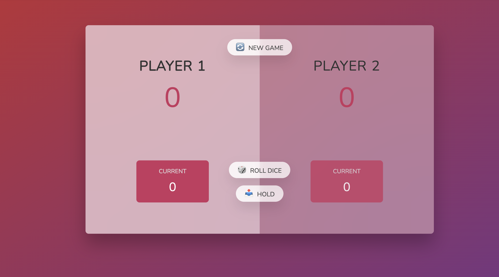

# 🎲 Pig Game

A simple two-player dice game built with vanilla JavaScript, HTML, and CSS.

## Rules

- Players take turns rolling a die to accumulate points.
- Rolling a **1** loses all points earned in the current turn and passes the turn.
- **Hold** banks the current turn's points to the player's score.
- First player to reach **100 points** wins.

## Tech

- HTML5
- CSS3
- Vanilla JavaScript (DOM manipulation)

## Run locally

Open `index.html` in your browser, or serve it with a local dev server (e.g. VS Code Live Server).

